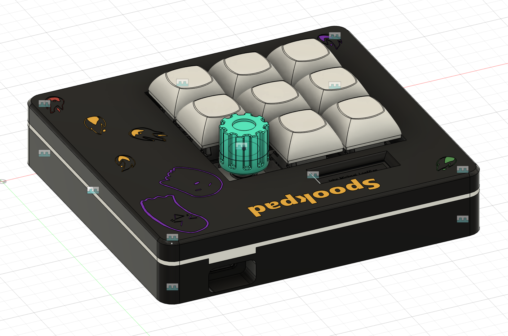
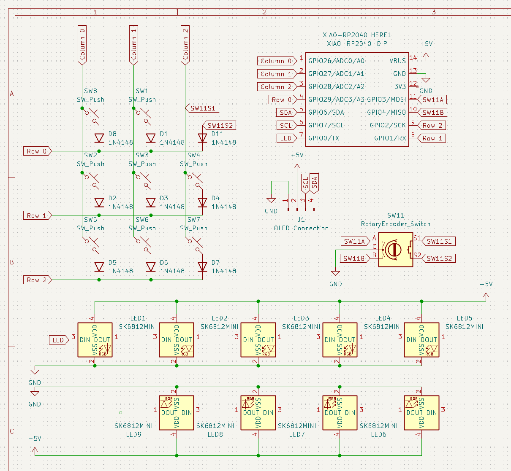
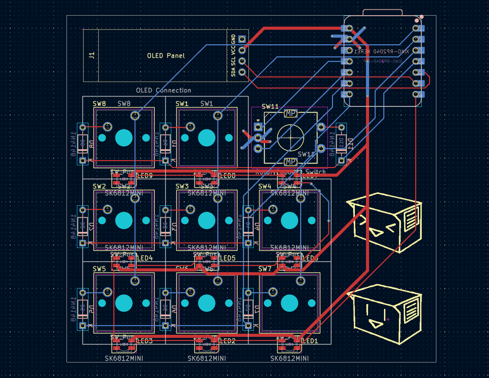

# Spookpad

A 3x3 macropad made with [Hack Club](https://hackclub.com/)'s [Hackpad](https://hackpad.hackclub.com) program.\
There are 8 keys that are backlit with LEDs, a rotary encoder, an OLED screen, and a XIAO RP2040 as the microcontroller.

## CAD

The case fits together using 4 M3 bolts and M3 heatset inserts.\
The case is made of 3 separate printed pieces.\
The PCB just floats inside the 3D printed case. I would suggest that some insulation or some other material is placed inside, so that the PCB being supported by that and not by the sautered joints.

## PCB

The PCB was created in Kicad. The silkscreen images were imported using Kicad's image converter.

### Schematic

#### PCB With Zones

#### PCB Without Zones

## Firmware

This macropad uses [QMK](https://docs.qmk.fm/) for firmware.

- Rotary encoder knob djusts the volume.
- By default, each key is bound to type out a number. (numbers are 1 through nine; sorry no zero)
- This macropad is compatible with [VIA](https://caniusevia.com/), so that it can actually macro.
- The OLED screen should play this animation at all times\

## Bill of Materials (BOM)

Physical materials needed to make this macropad

- 8x Cherry MX Switches
- 8x DSA Keycaps
- 1x EC11 Rotary Encoder
- 9x Through-hole 1N4148 Diodes
- 9x SK6812 MINI-E LEDs
- 4x M3x16mm Screws
- 4x M3x5mx4mm Heatset Inserts
- 1x 0.91" OLED Display
- 1x Seeed Studio XIAO RP2040
- 1x 3D printed knob for the rotary encoder
- 1x 3D printed case (3 separate pieces)

## Copyright

Copyright (C) 2025 101zh

This Source Code Form is subject to the terms of the Mozilla Public License, v. 2.0. If a copy of the MPL was not distributed with this file, You can obtain one at https://mozilla.org/MPL/2.0/.
